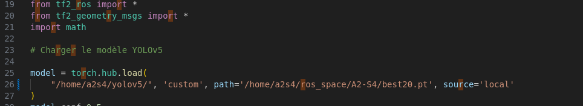

# Project Description

The goal of this project is to develop a Python program that allows a TurtleBot robot to autonomously navigate in a closed area and detect the presence of green ghosts.
The robot is capable of avoiding obstacles it detects through a laser scan. It recognizes objects using a camera mounted on the robot's head.
Project made by Alban Casella, Alexis Manuel and Suzanne-Léonore Girard-Jollet. Here's the video explaining our work : https://youtu.be/97TwO1b_6R8

## Prerequisites

To test the project, make sure the following steps are completed:
Install ROS2 on your machine.
You can follow the official documentation here: 

    
[docs.ros.org](https://docs.ros.org/en/iron/Installation.html)
    

Verify that Python 3 is installed on your machine and check the value of the ROS_Distro variable (ROS_DISTRO=iron).

Create a special package, which we can call ros_space, to hold the various GitHub repositories and libraries needed for the project.
You can use the following commands in your terminal:

```sh    
ros2 pkg create --build-type ament_cmake ros_space
colcon list
colcon build
```        

Set the ROS_DOMAIN_ID to value 24 by running the following commands:

```sh
export ROS_DOMAIN_ID=24
echo "export ROS_DOMAIN_ID=24" >> ~/.bashrc
```

Add additional libraries (pkg-interfaces, realsense2).
You can use the following commands:

Pkg-interfaces :

```sh
cd ros_space
git clone https://github.com/imt-mobisyst/pkg-interfaces.git
colcon build --base-path pkg-interfaces
source ./install/setup.bash
```
        
Realsense2 :

```sh  
git clone https://github.com/Microsoft/vcpkg.git
cd vcpkg
./bootstrap-vcpkg.sh
./vcpkg integrate install
./vcpkg install realsense2
```
    
Install Gazebo software by running the following commands in your terminal:

```sh
cd ~/ros_space
git clone https://github.com/imt-mobisyst/pkg-tsim
colcon build
source ./install/setup.bash
```


### Project Installation

To install the project, clone the A2-S4 GitHub repository using the following commands:

```sh
cd ros_space
git clone https://github.com/NABL-A/LARM-24.git
colcon build
source ./install/setup.bash
```


#### Usage

To start the simulation, use the following command, which will open a Gazebo window and launch the robot's movement simulation:

```sh    
ros2 launch grp_24 simulation_launch.yaml
```

to start the TurtleBot's navigation, use the following command:
   
```sh
ros2 launch grp_24 tbot_launch.yaml
```


### Install the necessary dependencies to run yolov5 :
```bash
git clone https://github.com/ultralytics/yolov5
pip install -r yolov5/requirements.txt
```
The installation of yolov5 can create a problem of compatibility with numpy. Indeed, yolov5 use a much recent version of numpy.

If the issue happens, one can downgrade the version of numpy to 1.26.4 using the command :
```bash
pip install numpy==1.26.4 --force-reinstall
```

Then, go to the script process_image (HOME/ros_space/tuto_vision/scripts/process_image.py)

Then, at the line below, replace "/home/a2s4/yolov5/" by the location directory of the yolov5 that you just download:




